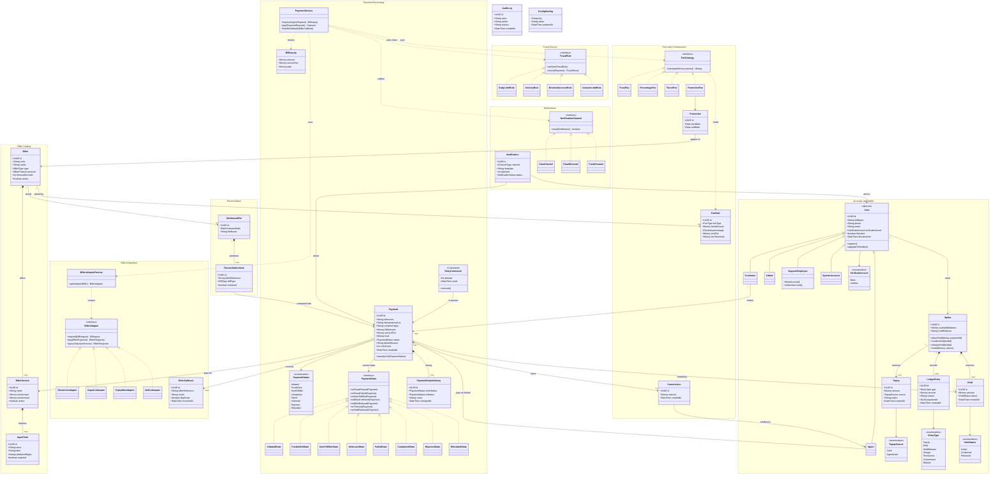

```mermaid
classDiagram
    direction TB

    namespace `Accounts and Wallet` {
        class User {
            <<abstract>>
            +UUID id
            +String fullName
            +String phone
            +String email
            +VerificationLevel verificationLevel
            +boolean blocked
            +DateTime blockedUntil
            +register()
            +upgradeToVerified()
        }
        class Customer
        class Agent
        class Admin
        class SupportEmployee {
            +blockAccount()
            +unblockAccount()
        }
        class SystemAccount
        class VerificationLevel {
            <<enumeration>>
            Basic
            Verified
        }
        class Wallet {
            +UUID id
            +Money availableBalance
            +Money heldBalance
            +placeHold(Money, paymentId)
            +confirmHold(holdId)
            +releaseHold(holdId)
            +credit(Money, reason)
        }
        class LedgerEntry {
            +UUID id
            +EntryType type
            +Money amount
            +String reason
            +UUID paymentId
            +DateTime createdAt
        }
        class Hold {
            +UUID id
            +Money amount
            +HoldStatus status
            +DateTime createdAt
        }
        class Topup {
            +UUID id
            +Money amount
            +TopupSource source
            +String status
            +DateTime createdAt
        }
        class TopupSource {
            <<enumeration>>
            Card
            AgentCash
        }
        class EntryType {
            <<enumeration>>
            TopUp
            Hold
            HoldRelease
            Charge
            FeeIncome
            Commission
            Refund
        }
        class HoldStatus {
            <<enumeration>>
            Active
            Confirmed
            Released
        }
    }

    namespace `Biller Catalog` {
        class Biller {
            +UUID id
            +String code
            +String name
            +BillerType type
            +BillerProtocol protocol
            +int timeoutSeconds
            +boolean active
        }
        class BillerService {
            +UUID id
            +String name
            +Money minAmount
            +Money maxAmount
            +boolean active
        }
        class InputField {
            +UUID id
            +String name
            +String label
            +String validationRegex
            +boolean required
        }
    }

    namespace `Payment Processing` {
        class PaymentService {
            +inquire(InquiryRequest) BillInquiry
            +pay(PaymentRequest) Payment
            +handleCallback(BillerCallback)
        }
        class BillInquiry {
            +Money amount
            +Money serviceFee
            +Money total
        }
        class Payment {
            +UUID id
            +String reference
            +String idempotencyKey
            +String customerInput
            +Money billAmount
            +Money serviceFee
            +Money total
            +PaymentStatus status
            +String failureReason
            +int retryCount
            +DateTime createdAt
            +transitionTo(PaymentStatus)
        }
        class PaymentStatus {
            <<enumeration>>
            Initiated
            FundsHeld
            SentToBiller
            Completed
            Failed
            Unknown
            Rejected
            Refunded
        }
        class PaymentState {
            <<interface>>
            +onFraudPassed(Payment)
            +onFraudFailed(Payment)
            +onSentToBiller(Payment)
            +onBillerConfirmed(Payment)
            +onBillerRefused(Payment)
            +onTimeout(Payment)
            +onHoldReleased(Payment)
        }
        class InitiatedState
        class FundsHeldState
        class SentToBillerState
        class UnknownState
        class FailedState
        class CompletedState
        class RejectedState
        class RefundedState
        class PaymentStatusHistory {
            +UUID id
            +PaymentStatus fromStatus
            +PaymentStatus toStatus
            +String cause
            +DateTime changedAt
        }
        class RetryCommand {
            <<Command>>
            +int attempt
            +DateTime runAt
            +execute()
        }
    }

    namespace `Biller Integration` {
        class BillerAdapter {
            <<interface>>
            +inquire(BillRequest) BillInquiry
            +pay(BillerPayment) BillerResponse
            +queryStatus(reference) BillerResponse
        }
        class ElectroCoAdapter
        class AquaCoAdapter
        class TopUpNetAdapter
        class NetCoAdapter
        class BillerAdapterFactory {
            +getAdapter(Biller) BillerAdapter
        }
        class BillerCallback {
            +UUID id
            +String billerReference
            +String result
            +boolean duplicate
            +DateTime receivedAt
        }
    }

    namespace `Fees and Commissions` {
        class FeeStrategy {
            <<interface>>
            +calculate(Money amount) Money
        }
        class FixedFee
        class PercentageFee
        class TieredFee
        class PromotionFee
        class FeeRule {
            +UUID id
            +FeeType feeType
            +Money fixedAmount
            +Decimal percentage
            +Money minFee
            +Money tierThreshold
        }
        class Promotion {
            +UUID id
            +Date startDate
            +Date endDate
        }
        class Commission {
            +UUID id
            +Money amount
            +DateTime createdAt
        }
    }

    namespace `Notifications` {
        class Notification {
            +UUID id
            +ChannelType channel
            +String template
            +int attempts
            +NotificationStatus status
        }
        class NotificationChannel {
            <<interface>>
            +send(Notification) boolean
        }
        class SmsChannel
        class EmailChannel
        class PushChannel
    }

    namespace `Fraud Checks` {
        class FraudRule {
            <<interface>>
            +setNext(FraudRule)
            +check(Payment) FraudResult
        }
        class DailyLimitRule
        class VelocityRule
        class BlockedAccountRule
        class AmountLimitRule
    }

    namespace `Reconciliation` {
        class SettlementFile {
            +UUID id
            +Date businessDate
            +String fileName
        }
        class ReconciliationItem {
            +UUID id
            +String billerReference
            +DiffType diffType
            +boolean reviewed
        }
    }

    class AuditLog {
        +UUID id
        +String actor
        +String action
        +String reason
        +DateTime createdAt
    }
    class ConfigSetting {
        +String key
        +String value
        +DateTime updatedAt
    }

    %% ---------- Accounts and Wallet ----------
    User <|-- Customer
    User <|-- Agent
    User <|-- Admin
    User <|-- SupportEmployee
    User <|-- SystemAccount
    User --> VerificationLevel
    User "1" --> "1" Wallet : owns
    Wallet "1" *-- "many" LedgerEntry : records
    Wallet "1" *-- "many" Hold : reserves
    Wallet "1" --> "many" Topup : receives
    Topup --> TopupSource
    LedgerEntry --> EntryType
    Hold --> HoldStatus

    %% ---------- Biller Catalog ----------
    Biller "1" *-- "many" BillerService : offers
    BillerService "1" *-- "many" InputField : requires

    %% ---------- Payment Processing ----------
    Customer "1" --> "many" Payment : makes
    Agent "0..1" --> "many" Payment : pays on behalf
    Payment --> BillerService : pays for
    Payment --> PaymentStatus
    Payment "1" --> "0..1" Hold : funded by
    Payment "1" *-- "many" PaymentStatusHistory : history
    Payment --> PaymentState : current state
    PaymentState <|.. InitiatedState
    PaymentState <|.. FundsHeldState
    PaymentState <|.. SentToBillerState
    PaymentState <|.. UnknownState
    PaymentState <|.. FailedState
    PaymentState <|.. CompletedState
    PaymentState <|.. RejectedState
    PaymentState <|.. RefundedState
    RetryCommand --> Payment : re-queries
    PaymentService ..> BillInquiry : returns
    PaymentService ..> FraudRule : uses chain
    PaymentService ..> FeeStrategy : uses
    PaymentService ..> BillerAdapterFactory : uses
    PaymentService ..> NotificationChannel : notifies

    %% ---------- Biller Integration ----------
    BillerAdapter <|.. ElectroCoAdapter
    BillerAdapter <|.. AquaCoAdapter
    BillerAdapter <|.. TopUpNetAdapter
    BillerAdapter <|.. NetCoAdapter
    BillerAdapterFactory ..> BillerAdapter : creates
    Payment "1" --> "many" BillerCallback : receives

    %% ---------- Fees and Commissions ----------
    FeeStrategy <|.. FixedFee
    FeeStrategy <|.. PercentageFee
    FeeStrategy <|.. TieredFee
    FeeStrategy <|.. PromotionFee
    FeeStrategy ..> FeeRule : reads
    Biller "1" --> "many" FeeRule : priced by
    PromotionFee --> Promotion
    Promotion --> Biller : applies to
    Payment "1" --> "0..1" Commission : earns
    Commission --> Agent : credited to

    %% ---------- Fraud Checks ----------
    FraudRule <|.. DailyLimitRule
    FraudRule <|.. VelocityRule
    FraudRule <|.. BlockedAccountRule
    FraudRule <|.. AmountLimitRule

    %% ---------- Notifications ----------
    NotificationChannel <|.. SmsChannel
    NotificationChannel <|.. EmailChannel
    NotificationChannel <|.. PushChannel
    Notification --> Payment : about
    Notification --> User : sent to

    %% ---------- Reconciliation ----------
    Biller "1" --> "many" SettlementFile : sends
    SettlementFile "1" *-- "many" ReconciliationItem : produces
    ReconciliationItem --> Payment : compared with
```
