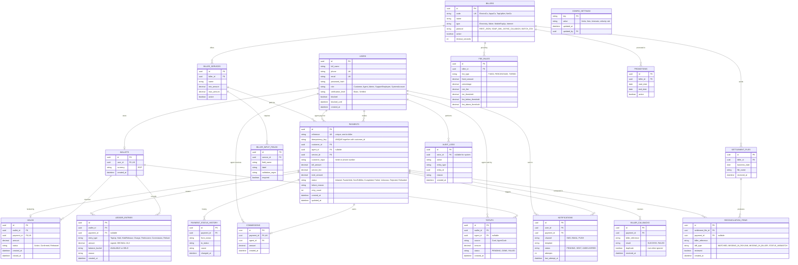

```mermaid
erDiagram
    USERS ||--o| WALLETS : owns
    WALLETS ||--o{ LEDGER_ENTRIES : records
    WALLETS ||--o{ HOLDS : reserves
    USERS ||--o{ PAYMENTS : makes
    USERS ||--o{ PAYMENTS : "agent pays for"
    BILLERS ||--o{ BILLER_SERVICES : offers
    BILLER_SERVICES ||--o{ BILLER_INPUT_FIELDS : requires
    BILLER_SERVICES ||--o{ PAYMENTS : "paid via"
    PAYMENTS ||--o| HOLDS : "funded by"
    PAYMENTS ||--o{ PAYMENT_STATUS_HISTORY : history
    PAYMENTS ||--o{ LEDGER_ENTRIES : "causes"
    PAYMENTS ||--o| COMMISSIONS : earns
    USERS ||--o{ COMMISSIONS : "agent receives"
    PAYMENTS ||--o{ NOTIFICATIONS : triggers
    USERS ||--o{ NOTIFICATIONS : "sent to"
    BILLERS ||--o{ FEE_RULES : "priced by"
    BILLERS ||--o{ PROMOTIONS : "promoted in"
    BILLERS ||--o{ SETTLEMENT_FILES : sends
    SETTLEMENT_FILES ||--o{ RECONCILIATION_ITEMS : produces
    PAYMENTS ||--o{ RECONCILIATION_ITEMS : "compared in"
    USERS ||--o{ AUDIT_LOGS : "performs"
    WALLETS ||--o{ TOPUPS : receives
    USERS ||--o{ TOPUPS : "agent cash by"
    PAYMENTS ||--o{ BILLER_CALLBACKS : receives

    USERS {
        uuid id PK
        string full_name
        string phone UK
        string email UK
        string password_hash
        string role "Customer, Agent, Admin, SupportEmployee, SystemAccount"
        string verification_level "Basic, Verified"
        boolean blocked
        datetime blocked_until
        datetime created_at
    }

    WALLETS {
        uuid id PK
        uuid user_id FK, UK
        string currency "EGP"
        datetime created_at
    }

    LEDGER_ENTRIES {
        uuid id PK
        uuid wallet_id FK
        uuid payment_id FK "nullable"
        string entry_type "TopUp, Hold, HoldRelease, Charge, FeeIncome, Commission, Refund"
        decimal amount "signed, DECIMAL 18,2"
        string balance_bucket "AVAILABLE or HELD"
        string reason
        datetime created_at
    }

    HOLDS {
        uuid id PK
        uuid wallet_id FK
        uuid payment_id FK, UK
        decimal amount
        string status "Active, Confirmed, Released"
        datetime created_at
        datetime closed_at
    }

    BILLERS {
        uuid id PK
        string code UK "ElectroCo, AquaCo, TopUpNet, NetCo"
        string name
        string type "Electricity, Water, MobileTopUp, Internet"
        string protocol "REST_JSON, SOAP_XML, ASYNC_CALLBACK, BATCH_CSV"
        boolean active
        int timeout_seconds
    }

    BILLER_SERVICES {
        uuid id PK
        uuid biller_id FK
        string name
        decimal min_amount
        decimal max_amount
        boolean active
    }

    BILLER_INPUT_FIELDS {
        uuid id PK
        uuid service_id FK
        string field_name
        string label
        string validation_regex
        boolean required
    }

    PAYMENTS {
        uuid id PK
        string reference UK "unique, sent to biller"
        string idempotency_key "UNIQUE together with customer_id"
        uuid customer_id FK
        uuid agent_id FK "nullable"
        uuid service_id FK
        string customer_input "meter or phone number"
        decimal bill_amount
        decimal service_fee
        decimal total_amount
        string status "Initiated, FundsHeld, SentToBiller, Completed, Failed, Unknown, Rejected, Refunded"
        string failure_reason
        int retry_count
        datetime created_at
        datetime updated_at
    }

    PAYMENT_STATUS_HISTORY {
        uuid id PK
        uuid payment_id FK
        string from_status
        string to_status
        string cause
        datetime changed_at
    }

    COMMISSIONS {
        uuid id PK
        uuid payment_id FK, UK
        uuid agent_id FK
        decimal amount
        datetime created_at
    }

    FEE_RULES {
        uuid id PK
        uuid biller_id FK
        string fee_type "FIXED, PERCENTAGE, TIERED"
        decimal fixed_amount
        decimal percentage
        decimal min_fee
        decimal tier_threshold
        decimal fee_below_threshold
        decimal fee_above_threshold
    }

    PROMOTIONS {
        uuid id PK
        uuid biller_id FK
        date start_date
        date end_date
        boolean active
    }

    NOTIFICATIONS {
        uuid id PK
        uuid user_id FK
        uuid payment_id FK
        string channel "SMS, EMAIL, PUSH"
        string template
        string status "PENDING, SENT, UNDELIVERED"
        int attempts
        datetime last_attempt_at
    }

    SETTLEMENT_FILES {
        uuid id PK
        uuid biller_id FK
        date business_date
        string file_name
        datetime received_at
    }

    RECONCILIATION_ITEMS {
        uuid id PK
        uuid settlement_file_id FK
        uuid payment_id FK "nullable"
        string biller_reference
        string diff_type "MATCHED, MISSING_IN_PAYLINK, MISSING_IN_BILLER, STATUS_MISMATCH"
        boolean reviewed
        datetime created_at
    }

    AUDIT_LOGS {
        uuid id PK
        uuid actor_id FK "nullable for system"
        string action
        string entity_type
        uuid entity_id
        string reason
        datetime created_at
    }

    CONFIG_SETTINGS {
        string key PK
        string value "limits, fees, timeouts, velocity rule"
        datetime updated_at
        uuid updated_by FK
    }

    TOPUPS {
        uuid id PK
        uuid wallet_id FK
        uuid agent_id FK "nullable"
        string source "Card, AgentCash"
        decimal amount
        string status "PENDING, DONE, FAILED"
        datetime created_at
    }

    BILLER_CALLBACKS {
        uuid id PK
        uuid payment_id FK
        string biller_reference
        string result "SUCCESS, FAILED"
        boolean duplicate "true when ignored"
        datetime received_at
    }
```
